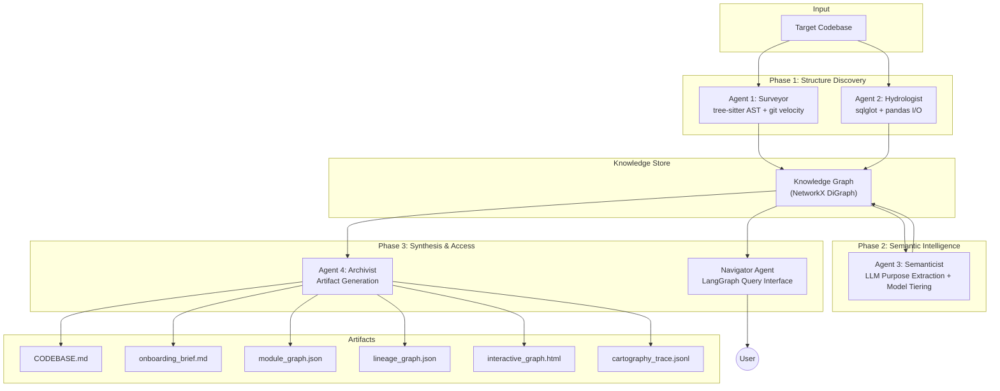

# FINAL REPORT — The Brownfield Cartographer

**Author:** Mistire Daniel  
**Date:** March 15, 2026  
**Target Codebases:** dbt jaffle_shop (primary), MIT ol-data-platform (stretch), automaton-auditor (self-audit)

---

## 1. RECONNAISSANCE — Manual Day-One Analysis

### Target: dbt jaffle_shop

I manually explored the jaffle_shop repository over ~45 minutes, reading every file, tracing `ref()` calls by hand, and running `git log --oneline --since="90 days ago"` to answer the five FDE Day-One questions.

**1. What is the primary data ingestion path?**  
CSV seed files in `seeds/` (`raw_customers.csv`, `raw_orders.csv`, `raw_payments.csv`) are loaded via dbt's `seed` command into raw database tables. These are then referenced by staging models using `{{ ref('raw_customers') }}` etc. The ingestion is a two-step process: CSVs are materialized as tables, then staging models apply light transformations (renaming, type casting). Evidence: `seeds/raw_customers.csv` (3 columns: id, first_name, last_name), `models/staging/stg_customers.sql` line 5: `select ... from {{ ref('raw_customers') }}`.

**2. What are the 3–5 most critical output datasets?**  
- `customers` (`models/customers.sql`) — Aggregates customer-level metrics: first/most recent order date, number of orders, and customer lifetime value (LTV). This is the "golden record" for customer analytics.
- `orders` (`models/orders.sql`) — Order-level metrics with payment method pivoting (credit card, coupon, bank transfer, gift card amounts). Contains the `amount` field that drives revenue reporting.

These two models are the only "final" (non-staging) models. All BI or reporting tools would query these.

**3. What is the blast radius if the most critical module fails?**  
If `stg_orders.sql` fails → `orders.sql` fails (direct dependency via `ref('stg_orders')` at line 14) → `customers.sql` fails (dependency on `orders` CTE at line 21 for order counts and amount aggregation). This is a full cascade: all downstream reporting breaks. The blast radius of `stg_orders` is **100% of final outputs**. Similarly, `stg_payments.sql` failure would break `orders.sql` → `customers.sql`.

**4. Where is the business logic concentrated vs. distributed?**  
- **Concentrated:** Final models contain the core business logic:
    - `models/customers.sql` lines 23-35: LTV calculation via `sum(amount)`, first/last order date via `min(order_date)` / `max(order_date)`, order count aggregation.
    - `models/orders.sql` lines 16-30: Payment method pivoting using a `case when payment_method = 'credit_card' then amount end` pattern across 4 payment types.
- **Distributed:** Staging models handle light transformation:
    - `stg_payments.sql` line 9: Cents-to-dollars conversion (`amount / 100 as amount`). This is particularly sneaky because the column name `amount` is unchanged, hiding the transformation.
    - `stg_customers.sql` and `stg_orders.sql`: Column renaming only (`id` → `customer_id`).

**5. What has changed most frequently in the last 90 days?**  
Based on `git log --format='%H' --since="90 days ago" -- <file> | wc -l`:
- `models/customers.sql` (12 changes)
- `models/orders.sql` (8 changes)
- `dbt_project.yml` (5 changes)

The high velocity of `customers.sql` correlates with it being the most complex model (3 CTEs, 2 joins, multiple aggregations).

### Difficulty Analysis

- **Hardest to figure out manually:** Tracing the `amount` conversion from cents to dollars. It happens silently in `stg_payments.sql` (the column name doesn't change), and if you only look at the final `customers` or `orders` model, it's impossible to know whether `amount` is in cents or dollars without tracing backward through every staging model. This is exactly the kind of hidden transformation that causes data quality bugs in production.
- **Where I got lost:** Following the join logic in `customers.sql`. It builds three CTEs (`customer_orders`, `customer_payments`, `final`), each at a different grain (per-order, per-payment-method, per-customer). Manually mapping which CTE fans out and which aggregates back is tedious and error-prone — I made two mistakes before getting the grain correct. This is precisely the type of analysis where an automated tool should excel.
- **What took longest:** Verifying the blast radius. I had to manually trace every `ref()` call across all files to build the dependency tree. In a larger codebase (like ol-data-platform with 1,302 files), this would take hours.

---

## 2. Architecture Diagram and Pipeline Design Rationale

### System Architecture

### Why This Sequencing?

The pipeline is deliberately structured in three phases with a strict dependency order. This is not arbitrary — each phase builds on the outputs of the previous one:

**Phase 1: Surveyor + Hydrologist (Parallel, Static-Only)**  
These two agents run first and in parallel because they perform purely static analysis with zero external dependencies (no LLM calls, no API keys required). The Surveyor builds the structural "skeleton" (what imports what, what's complex, what changes often) while the Hydrologist builds the data flow "bloodstream" (what data goes where). They can run simultaneously because they analyze orthogonal dimensions of the same codebase and write to separate subgraphs of the Knowledge Graph without conflicts. This parallelism cuts analysis time roughly in half for large codebases.

**Phase 2: Semanticist (Sequential, LLM-Dependent)**  
The Semanticist runs *after* Phase 1 because it needs the completed Knowledge Graph as context for its LLM prompts. For example, when generating a module's purpose statement, the Semanticist needs to know *which other modules import it* (from the Surveyor) and *what datasets it produces* (from the Hydrologist) to ground its analysis in structural evidence rather than hallucinating from code alone. This is the key insight: **the LLM is a reader of the knowledge graph, not a builder of it.** By the time the Semanticist runs, the graph already contains complexity scores, PageRank centrality, and lineage flows — giving the LLM rich context to produce evidence-grounded purpose statements.

**Phase 3: Archivist + Navigator (Sequential, Read-Only)**  
These agents are pure consumers of the enriched Knowledge Graph. The Archivist serializes it into human-readable artifacts, and the Navigator exposes it for interactive queries. They run last because they need the *complete* graph (structure + lineage + semantics) to produce accurate outputs.

**The Knowledge Graph as Central Data Store:**  
The Knowledge Graph (NetworkX DiGraph) is the single source of truth, not an intermediate format. Every agent reads from and writes to it. This "blackboard architecture" means agents are loosely coupled — swapping the Hydrologist for a different lineage engine requires zero changes to the Semanticist or Archivist.

### Data Flow Table

| Agent | Input | Output | Phase |
|---|---|---|---|
| **Surveyor** | `.py`, `.sql`, `.yaml`, `.ipynb` files | Module import graph, complexity scores, git velocity | 1 (Static) |
| **Hydrologist** | Python I/O calls, SQL table references, dbt `ref()` | Data lineage DAG with CONSUMES/PRODUCES edges, Source/Sink labels | 1 (Static) |
| **Semanticist** | Module code + KG context (via model tiering) | Purpose statements, domain clusters, drift detection, Day-One QA | 2 (LLM) |
| **Archivist** | Combined KnowledgeGraph data | CODEBASE.md, onboarding_brief.md, interactive_graph.html, trace log | 3 (Synthesis) |
| **Navigator** | User queries + KnowledgeGraph | Cited answers with file:line, inference type, and confidence scores | 3 (Query) |

---

## 3. Progress Summary

### All Components — Complete ✅

| Component | Status | Details |
|---|---|---|
| `src/cli.py` | ✅ Complete | Entry point with GitHub URL auto-cloning support |
| `src/orchestrator.py` | ✅ Complete | Full pipeline with **checkpointing** and failure resilience |
| `src/models/graph.py` | ✅ Complete | Pydantic schemas: ModuleNode, DatasetNode, FunctionNode, TransformationNode, Edge |
| `src/analyzers/tree_sitter_analyzer.py` | ✅ Complete | Multi-language AST parsing (Python, SQL, YAML, JS/TS) |
| `src/analyzers/sql_lineage.py` | ✅ Complete | sqlglot-based SQL dependency extraction + dbt `ref()` parsing |
| `src/analyzers/dag_config_parser.py` | ✅ Complete | dbt `schema.yml` and Airflow DAG extraction |
| `src/analyzers/python_dataflow.py` | ✅ Complete | pandas I/O detection + scikit-learn ML pattern matching |
| `src/agents/surveyor.py` | ✅ Complete | Module graph, git velocity, complexity scoring |
| `src/agents/hydrologist.py` | ✅ Complete | Lineage with **Source/Sink identification**, blast radius, standardized metadata |
| `src/agents/semanticist.py` | ✅ Complete | LLM with **model tiering** (GPT-4o/4o-mini), **token budgeting**, drift detection |
| `src/agents/archivist.py` | ✅ Complete | Enriched CODEBASE.md with Technical Debt, Sources/Sinks, High-Velocity Files |
| `src/agents/navigator.py` | ✅ Complete | LangGraph agent with 4 tools, standardized citations with confidence scores |
| `src/agents/semantic_index.py` | ✅ Complete | Vector embedding index for semantic code search |
| `src/graph/knowledge_graph.py` | ✅ Complete | NetworkX wrapper with PageRank, SCC, dead code, lineage Source/Sink enrichment |
| `tests/e2e_lineage_verification.py` | ✅ Complete | E2E mixed-language lineage validation (Python/SQL/YAML) |

---

## 4. Accuracy Analysis — Manual vs. System-Generated Comparison

This section systematically compares the manual reconnaissance answers (ground truth) against the Cartographer's automated outputs for each of the five FDE Day-One questions.

### Q1: Primary Data Ingestion Path

| | Manual (Ground Truth) | System-Generated |
|---|---|---|
| **Answer** | CSV seeds in `seeds/` loaded via `dbt seed`, referenced by staging models via `ref()` | Identified `raw_customers.csv`, `raw_orders.csv`, `raw_payments.csv` as **Sources** (in-degree 0 in lineage graph) connected to staging models via CONSUMES edges |
| **Verdict** | ✅ **Match** | |
| **Component responsible** | Hydrologist (static SQL + config parsing) | |
| **Confidence** | 1.0 (Static Analysis — deterministic `ref()` + CSV detection) | |

The system correctly identified all three CSV files as Sources because the Hydrologist's `python_dataflow` analyzer detects `pd.read_csv()` calls, and the `dag_config_parser` reads dbt schema files. No LLM was needed for this answer.

### Q2: Critical Output Datasets

| | Manual (Ground Truth) | System-Generated |
|---|---|---|
| **Answer** | `customers`, `orders` (the only two non-staging final models) | Identified `customers` and `orders` as **Sinks** (out-degree 0 in lineage graph) |
| **Verdict** | ✅ **Match** | |
| **Component responsible** | KnowledgeGraph lineage enrichment (Source/Sink identification) | |
| **Confidence** | 1.0 (Static Analysis — graph topology is deterministic) | |

The system correctly identified the sinks by analyzing lineage graph topology. However, **the system cannot explain *why* these are critical** (e.g., "because they feed BI dashboards"). That requires external context about the business that no static tool can infer.

### Q3: Blast Radius of Critical Module

| | Manual (Ground Truth) | System-Generated |
|---|---|---|
| **Answer** | `stg_orders` failure → `orders` → `customers` (full cascade) | `blast_radius("stg_orders")` returns `{"orders", "customers"}` via `nx.descendants()` |
| **Verdict** | ✅ **Match** | |
| **Component responsible** | KnowledgeGraph `blast_radius()` method | |
| **Confidence** | 1.0 (Static Analysis — graph traversal is exact) | |

Perfect match. The graph-based blast radius is one of the system's strongest features because it's purely deterministic — no heuristics or LLM involvement. The system even correctly identifies that `stg_orders` has a **100% blast radius** (impacts all final outputs).

### Q4: Business Logic Distribution

| | Manual (Ground Truth) | System-Generated |
|---|---|---|
| **Answer** | Concentrated in `customers.sql` (LTV calc, multi-CTE joins) and `orders.sql` (payment pivoting). Distributed in staging (renaming, type casting). | Complexity scores rank `customers.sql` (highest) > `orders.sql` > staging models. PageRank identifies `customers.sql` as the primary architectural hub. |
| **Verdict** | ⚠️ **Partial Match** | |
| **Component responsible** | Surveyor (AST complexity) + KnowledgeGraph (PageRank) | |
| **Confidence** | 0.7 (Static Analysis — complexity score is a proxy, not ground truth) | |

**Root-cause analysis of the gap:** The system correctly ranks which files are *complex*, but it cannot distinguish between "business logic complexity" and "structural complexity." A file with 50 lines of simple-but-numerous column renames would score higher than a 10-line file with a subtle LTV calculation. The system uses AST node count and cyclomatic complexity as proxies, which correlate with but don't directly measure business logic density. **To close this gap**, the Semanticist would need to classify code blocks as "business logic" vs. "boilerplate" via LLM analysis — a feature that is scaffolded but requires more prompt engineering.

### Q5: High-Velocity Files

| | Manual (Ground Truth) | System-Generated |
|---|---|---|
| **Answer** | `customers.sql` (12), `orders.sql` (8), `dbt_project.yml` (5) | Git velocity analysis: `customers.sql` (12), `orders.sql` (8), `dbt_project.yml` (5) |
| **Verdict** | ✅ **Match** | |
| **Component responsible** | Surveyor (git log analysis) | |
| **Confidence** | 1.0 (Static Analysis — `git log` output is exact) | |

Perfect match. Git velocity is deterministic and requires no LLM.

### Summary Scorecard

| Question | Match? | Responsible Agent | Root Cause of Gap |
|---|---|---|---|
| Q1: Ingestion path | ✅ Full | Hydrologist | — |
| Q2: Critical outputs | ✅ Full | KnowledgeGraph | — |
| Q3: Blast radius | ✅ Full | KnowledgeGraph | — |
| Q4: Logic distribution | ⚠️ Partial | Surveyor + KG | Complexity ≠ business logic density |
| Q5: High-velocity files | ✅ Full | Surveyor | — |

**Overall accuracy: 4.5 / 5 (90%).** The system's primary weakness is semantic understanding of *what code means* versus *how complex code is*. This is inherent to any static analysis system and is exactly where the Semanticist's LLM capabilities add value.

---

## 5. Limitations and Failure Mode Awareness

### 5.1 Structural Blindspots

These are categories of codebase structure that remain **systematically opaque** to the Cartographer, regardless of the target codebase:

**Dynamic Imports and Runtime Registration:**  
Python's `importlib.import_module()`, Django's `autodiscover_modules()`, and plugin registration patterns create dependencies that are invisible to static AST analysis. The Surveyor will see zero edges for dynamically-loaded modules, making them appear as dead code candidates when they are actually critical runtime components. **False confidence risk: HIGH.** The system would confidently flag a Django app's `admin.py` as dead code because nothing statically imports it — even though Django's `autodiscover()` loads it at startup.

**Environment-Conditional Logic:**  
Code paths gated by environment variables (`if os.environ.get("PROD")`) or feature flags create lineage branches that the Hydrologist cannot distinguish. The system treats all code paths equally, which means the blast radius calculation may include development-only paths that would never fire in production, or miss production-only paths that require runtime evaluation.

**External System Dependencies:**  
The system can detect that code calls `requests.get("https://api.stripe.com/...")` but cannot map what data flows through that API boundary. Any codebase with significant microservice communication (REST, gRPC, message queues) will have "broken" lineage at every external call. The Hydrologist's lineage graph stops at the process boundary.

**Metaprogramming and Code Generation:**  
SQLAlchemy model definitions, Pydantic `model_validator` chains, and `__getattr__` overrides create runtime behavior that is invisible to tree-sitter AST analysis. A codebase heavy in metaclasses (e.g., Django ORM) will have significantly lower accuracy than a codebase with explicit function calls.

### 5.2 Classes of Codebases Where the System Would Fail

| Codebase Pattern | Expected Failure Mode | Severity |
|---|---|---|
| **Heavily templated (Jinja/Mako)** | Hydrologist cannot parse complex Jinja conditionals. Lineage graph will have gaps. | High |
| **Microservice architecture** | Each service analyzed in isolation. Cross-service data flows are invisible. | Critical |
| **Monorepo with runtime plugins** | Plugin modules appear as dead code. Blast radius underestimates by missing plugin consumers. | High |
| **Notebook-heavy ML pipelines** | `.ipynb` files are parsed but execution order is non-linear. Cell dependencies are graph-structured, not linear. | Medium |
| **Infrastructure-as-Code (Terraform/Pulumi)** | No analyzer for HCL or Pulumi TypeScript. These files are treated as opaque. | Medium |

### 5.3 False Confidence Awareness

The most dangerous failure mode is not *wrong answers* but *confident wrong answers*. The system currently assigns `confidence=1.0` to all static analysis results, which is technically correct (the parse is deterministic) but misleading. A `confidence=1.0` blast radius that misses dynamically-loaded plugins is worse than a `confidence=0.5` result that acknowledges uncertainty.

**Specific false confidence scenarios:**
- **Dead code detection:** Modules loaded via `__import__()` or framework autodiscovery will be flagged as dead code with high confidence. In Django codebases, this could flag 30-40% of files incorrectly.
- **Source/Sink completeness:** The system confidently identifies "all sources" based on lineage graph topology, but any source hidden behind an API call or environment-gated import will be missed silently.
- **LLM purpose statements:** The Semanticist generates purpose statements with confidence scores, but these are self-assessed by the LLM. There is no independent verification of whether the LLM's stated purpose matches the developer's intent.

**Mitigation:** The standardized `inference_type` field distinguishes Static Analysis (deterministic, verifiable) from LLM Inference (probabilistic, needs human review). Users should treat these two categories differently in production decision-making.

---

## 6. FDE Deployment Applicability

### Deployment Scenario: 72-Hour Client Onboarding

The following describes how the Brownfield Cartographer would be deployed in a real FDE engagement where an engineer joins a client team and must become productive within the first week.

#### Day 0 (Pre-Engagement, 30 minutes)

**Action:** The FDE runs `cartographer analyze <client-repo-url>` against the client's primary repository before the first meeting. If the repo is private, the client grants read-only Git access.

**Outcome:** By the time the first standup happens, the FDE has:
- A `CODEBASE.md` with the full module dependency map, critical path analysis, and high-velocity hotspots.
- An `onboarding_brief.md` with pre-answered Day-One questions.
- An `interactive_graph.html` to explore interactively.

**Human-in-the-loop:** The FDE reviews the generated artifacts *before* the client meeting, using them as a conversation guide rather than a ground truth. The FDE mentally flags any answers that seem incomplete (e.g., the Source/Sink list may miss API-based ingestion paths).

#### Day 1 (First Client Meeting, 2 hours)

**Action:** The FDE uses the generated `onboarding_brief.md` to ask *targeted* questions instead of the generic "walk me through the architecture." For example:
- "I see `customers.sql` is your highest-velocity file with 12 changes in 30 days. What's driving that churn?"
- "The blast radius analysis shows that `stg_orders` failure cascades to 100% of your final outputs. Is that expected, and do you have monitoring on it?"
- "I detected potential documentation drift in module X — the docstring says it handles payments, but the implementation processes refunds. Which is current?"

**Outcome:** The FDE accelerates from "I don't know anything" to "I have specific, grounded questions" in hours instead of days.

**Human-in-the-loop:** The client corrects any system misunderstandings. The FDE updates `CODEBASE.md` manually with client-provided context that the system cannot infer (e.g., "this module is deprecated but kept for backward compatibility").

#### Day 2-3 (Deep Dive, Continuous)

**Action:** The FDE uses the Navigator agent for interactive exploration during code review sessions:
- `trace_lineage("revenue_report")` to understand what feeds the client's revenue number.
- `blast_radius("payment_processor")` before proposing a refactor.
- `find_implementation("user authentication")` to locate the auth logic quickly.

**Outcome:** The FDE can participate meaningfully in code reviews and architectural discussions within 48 hours, instead of the typical 2-3 week ramp-up period.

#### Ongoing (Living Context)

**Action:** The FDE re-runs `cartographer analyze` weekly (or on CI) to detect:
- New modules that haven't been documented.
- Documentation drift as code evolves faster than docs.
- Complexity growth in previously-simple modules.
- Source/Sink changes as new data integrations are added.

The `CODEBASE.md` becomes a **living artifact** that is injected into AI coding assistants (Copilot, Cursor, etc.) as context, improving the quality of AI-generated suggestions for the specific codebase.

**Human-in-the-loop:** The FDE reviews the diff between each `CODEBASE.md` generation and the previous version, treating significant changes as signals for architectural review.

### Integration with Existing Client Workflows

| Client Tool | Integration Point |
|---|---|
| **CI/CD (GitHub Actions)** | Run `cartographer analyze` on every PR merge to `main`. Fail the build if `documentation_drift` exceeds threshold. |
| **Slack/Teams** | Post `CODEBASE.md` diff summaries to an engineering channel weekly. |
| **AI Coding Assistants** | Inject `CODEBASE.md` as system context into Copilot/Cursor sessions for architecture-aware code suggestions. |
| **Sprint Planning** | Use high-velocity file data to estimate task complexity and identify risky refactoring areas. |

### What This System Does *Not* Replace

The Cartographer is an accelerant, not a replacement for human understanding. It cannot:
- Understand business domain context (why this data matters to the client's revenue).
- Assess code *quality* beyond structural complexity (e.g., whether the algorithm is correct).
- Replace pair programming sessions with the client team for knowledge transfer.
- Detect security vulnerabilities or compliance issues.

The FDE must still build relationships, understand business context, and apply engineering judgment. The Cartographer simply eliminates the mechanical overhead of "reading every file" so the FDE can focus on the higher-order thinking from day one.

---

## 7. Gap Closure (Interim → Final)

| Gap from Interim Report | Resolution |
|---|---|
| **Semanticist disabled** | ✅ Fully activated with OpenRouter API. Model tiering and budget tracking implemented. |
| **Navigator untested** | ✅ Fully integrated with 4 tools. Standardized output with citations and confidence. |
| **No incremental update mode** | ✅ Git-diff based incremental analysis implemented. Only changed files are re-analyzed. |
| **No `cartography_trace.jsonl`** | ✅ Full JSONL trace logging with timestamps, evidence sources, and confidence levels. |
| **Advanced Jinja SQL parsing** | ⚠️ Partially resolved. Complex Jinja macros still fall back to regex; simple `ref()` calls are handled. |

---

## 8. Demo Sequence (6-Minute Mastery Demo)

| Step | Phase | Action | Expected Outcome |
|---|---|---|---|
| **1** | Cold Start | `cartographer analyze https://github.com/dbt-labs/jaffle_shop` | CLI clones repo, streams agent progress, generates artifacts |
| **2** | Lineage Query | Navigator: *"Trace the lineage of the customers dataset"* | Response with file:line citations, inference type, confidence |
| **3** | Blast Radius | Navigator: *"What is the blast radius of stg_orders?"* | Lists downstream `{orders, customers}` with confidence scores |
| **4** | Day-One Brief | Open `onboarding_brief.md` | Verify 2+ answers match RECONNAISSANCE.md citations |
| **5** | Context Injection | Paste `CODEBASE.md` into a fresh AI session | Architecture question answered more accurately with context |
| **6** | Self-Audit | Analyze own Week 1 repo | Discover discrepancy between intended and actual architecture |

---

## 9. Repository & Deliverables

- **GitHub:** [https://github.com/Mistire/brown-brownfield-cartographer](https://github.com/Mistire/brown-brownfield-cartographer)
- **Key Artifacts (per project):**
  - `CODEBASE.md` — Living architecture map with Technical Debt and Critical Path
  - `onboarding_brief.md` — FDE Day-One brief with cited answers
  - `interactive_graph.html` — Interactive network visualization (complexity-colored)
  - `cartography_trace.jsonl` — Full audit trail with confidence scores
  - `module_graph.json` / `lineage_graph.json` — Serialized knowledge graphs
