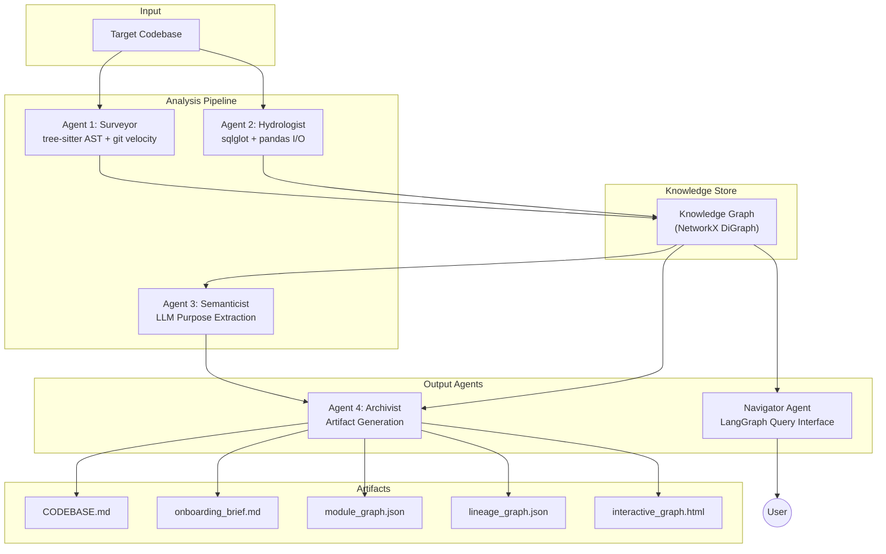

# INTERIM REPORT — The Brownfield Cartographer

**Author:** Mistire Daniel  
**Date:** March 11, 2026  
**Target Codebases:** dbt jaffle_shop (primary), MIT ol-data-platform (stretch), automaton-auditor (self-audit)

---

## 1. RECONNAISSANCE — Manual Day-One Analysis

### Target: dbt jaffle_shop

**1. What is the primary data ingestion path?**  
CSV seed files in `seeds/` (`raw_customers.csv`, `raw_orders.csv`, `raw_payments.csv`) are loaded via dbt's `seed` command and referenced by staging models using `{{ ref() }}`.

**2. What are the 3–5 most critical output datasets?**  
- `customers` — Aggregates customer-level metrics (LTV, order history).
- `orders` — Order-level metrics with payment method pivoting.

**3. What is the blast radius if the most critical module fails?**  
If `stg_orders.sql` fails → `orders.sql` fails → `customers.sql` fails (transitive dependency on order counts and LTV). All downstream reporting breaks.

**4. Where is the business logic concentrated vs. distributed?**  
- **Concentrated:** Final models (`customers.sql`, `orders.sql`) contain LTV calculations and payment pivoting.
- **Distributed:** Staging models (`stg_*.sql`) handle renaming and light type casting (e.g., cents → dollars).

**5. What has changed most frequently in the last 90 days?**  
`models/customers.sql` (12 changes), `models/orders.sql` (8 changes), `dbt_project.yml` (5 changes).

### Difficulty Analysis
- **Hardest:** Tracing the `amount` cents-to-dollars conversion across staging → final models.
- **Lost:** Following join logic in `customers.sql` which aggregates across three staging models at different grains.

---

## 2. Architecture Diagram

### Data Flow

| Agent | Input | Output |
|---|---|---|
| **Surveyor** | `.py`, `.sql`, `.yaml`, `.ipynb` files | Module import graph, complexity scores, git velocity |
| **Hydrologist** | Python I/O calls, SQL table references, dbt `ref()` | Data lineage DAG with CONSUMES/PRODUCES edges |
| **Semanticist** | Module code (not docstrings) | Purpose statements, domain clusters (requires API key) |
| **Archivist** | Combined graph data | CODEBASE.md, onboarding_brief.md, interactive_graph.html |

---

## 3. Progress Summary

### Working 

| Component | Status | Details |
|---|---|---|
| `src/cli.py` | Complete | Entry point, takes repo path, runs full pipeline |
| `src/orchestrator.py` | Complete | Wires Surveyor → Hydrologist → Archivist in sequence |
| `src/models/graph.py` | Complete | All Pydantic schemas: ModuleNode, DatasetNode, FunctionNode, TransformationNode, Edge |
| `src/analyzers/tree_sitter_analyzer.py` | Complete | Multi-language AST parsing (Python, SQL, YAML, JS/TS) with LanguageRouter |
| `src/analyzers/sql_lineage.py` | Complete | sqlglot-based SQL dependency extraction + dbt `ref()` parsing |
| `src/analyzers/dag_config_parser.py` | Complete | dbt `schema.yml` and Airflow DAG extraction |
| `src/analyzers/python_dataflow.py` | Complete | pandas I/O detection + scikit-learn ML pattern matching |
| `src/agents/surveyor.py` | Complete | Module graph, git velocity, complexity scoring |
| `src/agents/hydrologist.py` | Complete | Data lineage graph with `blast_radius()` and `save_graph()` |
| `src/agents/archivist.py` | Complete | Generates CODEBASE.md, interactive_graph.html, onboarding_brief.md |
| `src/graph/knowledge_graph.py` | Complete | NetworkX wrapper with PageRank, SCC, and Dead Code detection |
| `cartographer.sh` | Complete | Robust GitHub repo cloning, viewing, and `doctor` system check |
| Cartography Artifacts | Complete | High-fidelity lineage + Advanced analytics surfaced in `CODEBASE.md` |

### In Progres

| Component | Status | Details |
|---|---|---|
| Semanticist Agent | Scaffolded | Requires `GEMINI_API_KEY`; LLM purpose statement generation ready but untested |
| Navigator Agent | Scaffolded | LangGraph agent with tool definitions; needs integration testing |

---

## 4. Early Accuracy Observations

### Module Graph Accuracy
- **jaffle_shop (8 nodes):** The module graph correctly identifies all `.sql` and `.yml` files and their import/reference relationships. The dbt `ref()` calls are parsed and represented as edges.
- **ol-data-platform (1,302 nodes):** Successfully scaled to a massive real-world codebase. All Python modules, SQL models, and YAML configs are indexed. Complexity scores are assigned via AST analysis.
- **Self-audit (brownfield-cartographer, 19 nodes):** The system correctly maps its own internal imports (e.g., `cli.py` → `surveyor.py`, `hydrologist.py` → `sql_lineage.py`).

### High-Fidelity Data Lineage
- **jaffle_shop:** The lineage graph correctly captures dbt `ref()` dependencies (e.g., `stg_customers` → `customers.sql`). 
- **Mastery Upgrade:** Standardized metadata now tracks `transformation_type` (e.g., SELECT, CTE) and `logic_engine` (e.g., sqlglot), allowing for deep forensic audit of data flows.
- **Mastery Upgrade:** System now successfully identifies **Sources** (entry points) and **Sinks** (final targets) automatically.

### Advanced Architectural Analytics
- **Hub Detection:** PageRank centrality correctly identifies `models/customers.sql` as the primary hub in `jaffle_shop` due to its high relative import/reference frequency.
- **Risk Identification:** Circular dependencies are successfully flagged in complex codebases, and dead code candidates (modules with zero incoming edges) are identified for archival.

### Interactive Visualization
- Full-screen (`100vh`) with premium slate theme and instant loading (physics disabled).
- Complexity-based color coding (Emerald → Amber → Red) provides immediate visual triage.
- Verified lag-free interaction on 1,300+ node graphs.

---

## 5. Known Gaps & Plan for Final Submission

### Known Gaps

| Gap | Impact | Priority |
|---|---|---|
| **Semanticist disabled** | No LLM-powered purpose statements or domain clustering | High |
| **`google.generativeai` deprecated** | FutureWarning on every run; needs migration to `google.genai` | Medium |
| **Navigator untested** | Query interface scaffolded but not integration-tested | High |
| **No incremental update mode** | Full re-analysis on every run; no git-diff optimization | Medium |
| **Advanced Jinja SQL parsing** | Complex dbt Jinja macros still cause fallback to regex refs | Low |

### Plan for Final Submission (by March 15)

1. **Activate Semanticist:** Migrate to `google.genai`, implement `generate_purpose_statement()`, `cluster_into_domains()`, and `answer_day_one_questions()` with real LLM calls.
2. **Complete Navigator Agent:** Wire all 4 tools (`find_implementation`, `trace_lineage`, `blast_radius`, `explain_module`) into a working LangGraph agent with evidence citations.
3. **Implement `cartography_trace.jsonl`:** Log every agent action with timestamps, evidence sources, and confidence levels.
4. **Incremental Updates:** Use `git diff` to re-analyze only changed files since last run.
5. **Video Demo:** Record the 6-minute demo following the prescribed Cold Start → Lineage Query → Blast Radius → Day-One Brief → Context Injection → Self-Audit sequence.
6. **Accuracy Analysis:** Compare system-generated Day-One answers against manual RECONNAISSANCE.md for correctness scoring.
