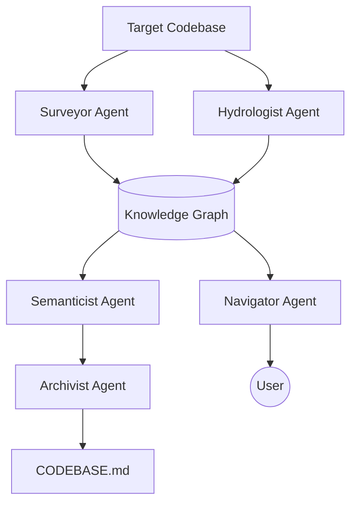

# The Brownfield Cartographer

**Engineering Codebase Intelligence Systems for Rapid FDE Onboarding in Production Environments**

The Brownfield Cartographer is a multi-agent system designed to rapidly map and analyze complex, unfamiliar codebases. It specifically targets data engineering and data science stacks, producing living, queryable knowledge graphs of architecture, data flows, and semantic structure.

## The Cartographer's Agents

- **Agent 1: The Surveyor (Static Structure)**
  Performs deep static analysis using `tree-sitter`. Builds the module import graph, identifies the public API surface, and tracks change velocity via `git`. **Mastery Upgrade:** Now computes PageRank centrality, detects circular dependencies (SCC), and identifies dead code candidates.

- **Agent 2: The Hydrologist (Data Lineage)**
  Specialized for data engineering. Constructs the data lineage DAG by analyzing data sources, transformations (SQL/Python), and sinks across the repo. **Mastery Upgrade:** Standardized high-fidelity lineage metadata with transformation types and multi-dialect SQL support.

- **Agent 3: The Semanticist (LLM Analysis)**
  Uses LLMs (Gemini Flash) to extract purpose statements grounded in implementation evidence, detecting "documentation drift" and clustering modules into business domains.

- **Agent 4: The Archivist (Living Context)**
  Maintains the system's outputs as living artifacts: `CODEBASE.md`, `onboarding_brief.md`, and serialized lineage graphs.

- **The Navigator (Query Interface)**
  A LangGraph-based agent that allows exploratory investigation of the codebase through natural language queries.

## Getting Started

### Prerequisites

- [uv](https://github.com/astral-sh/uv) (Python package manager)
- [Git](https://git-scm.com/)
- [Gemini API Key](https://aistudio.google.com/) (required for the Semanticist agent)

### Installation

1. Clone the repository:
   ```bash
   git clone https://github.com/Mistire/brown-brownfield-cartographer.git
   cd brown-brownfield-cartographer
   ```

2. Install dependencies:
   ```bash
   uv sync
   ```

3. Export your API Key:
   ```bash
   export GEMINI_API_KEY="your_api_key_here"
   ```

## Usage (Simplified 🚀)

Use the `./cartographer.sh` helper script for the fastest workflow.

### 1. Analyze a Repository
Map any GitHub repository or local path:
```bash
./cartographer.sh map https://github.com/dbt-labs/jaffle_shop
```
*Artifacts are saved to `.cartography/jaffle_shop/`.*

### 2. View the Dashboard
Launch the interactive visualization with automatic port-cleanup:
```bash
./cartographer.sh view jaffle_shop
```
*Visit http://localhost:8000 to explore.*

### 3. List Mapped Projects
See all your analyzed codebases:
```bash
./cartographer.sh list
```

### 4. System Check (Doctor)
Verify system dependencies (tree-sitter, sqlglot, etc.):
```bash
./cartographer.sh doctor
```

---

## Technical CLI Usage

For advanced users, use the structured CLI:

```bash
uv run cartographer /path/to/target/repo
```

## Outputs
Each project generates its own set of artifacts in `.cartography/<project_name>/`:
- **`interactive_graph.html`**: Premium, full-screen interactive network map.
- **`onboarding_brief.md`**: "Day-One" brief of complexity and velocity hotspots.
- **`CODEBASE.md`**: Living technical specification with Mermaid diagrams.

## Architecture


